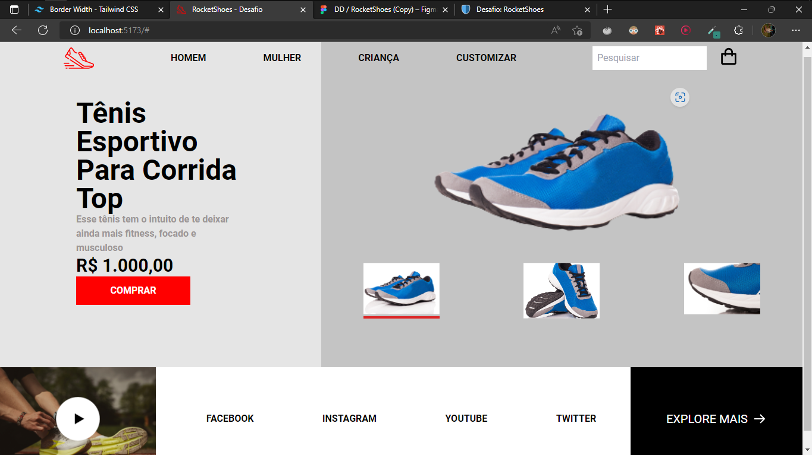

# Desafio Proposto Pela Rocketseat 👊
O desafio era criar uma página de vendas de pares de tênis, seguindo o modelo do Figma disponibilizado pela Rocketseat. Não havia restrições sobre qual tecnologia usar.

# Tecnologias Utilizadas 💻
- Tailwind CSS
- ReactJS
- Typescript
- Vite
- HTML5
- CSS3
- Background Remover (Web App.)

# Resultado 🚀

# Obrigado por ver o meu repositório. Até a próxima 👋